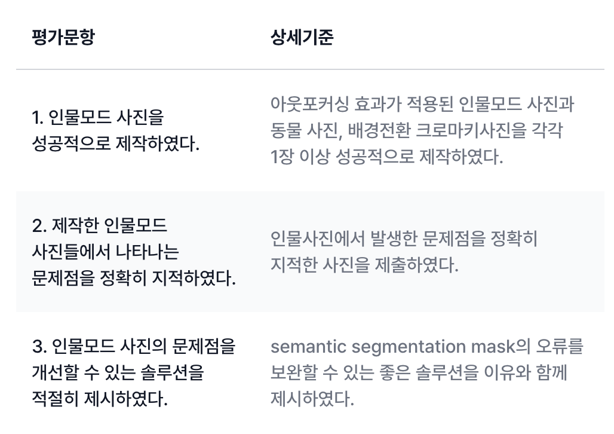

# Exploration 03 Project - semantic_segmentation : 민혁, 조규원, 신상호, 고은비

## 루브릭



평가문항 -> 상세기준

1. 인물모드 사진을 성공적으로 제작하였다. 아웃포커싱 효과가 적용된 인물모드 사진과 동물 사진, 배경전환 크로마키사진을 각각 1장 이상 성공적으로 제작하였다.
2. 제작한 인물모드 사진들에서 나타나는 문제점을 정확히 지적하였다. 인물사진에서 발생한 문제점을 정확히 지적한 사진을 제출하였다.
3. 인물모드 사진의 문제점을 개선할 수 있는 솔루션을 적절히 제시하였다. semantic segmentation mask의 오류를 보완할 수 있는 좋은 솔루션을 이유와 함께 제시하였다.

 

처음 할머니와 할머니가 같이 들고있는 배추를 함께 자르려고 했는데 할머니 '신체' 부분만 잘리는 문제가 생겼다.

이후 모델을 변경하여 


성공적으로 누끼를 따는 모습을 볼 수 있다. 


기존에 실행했었던 강아지 누끼도 털 부분도 세세하게 잘라주는 모습을 볼 수 있다.


기존에 피라미드 사진과 배추할머니 사진을 같이 합성해보려고 하였지만 합성 후에 할머니가 사라지는 문제가 생겼다. 


코드 수정 후 같이 잘 합성되는 모습을 볼 수 있다.


추가적으로 실행한 강아지 합성

## 코더 회고

- 배운 점
  - 고은비: DeepLabV3와 RMBG 모델을 활용하여 배경을 제거하는, 즉 누끼를 따는 방법을 배웠습니다.   
  - 민혁:
  - 조규원:
  - 신상호: RMBG 모델 활용 방법(이미지 배경 분리), 다른 배경 삽입, 플러터 앱으로 구현

- 아쉬운 점
  - 고은비: 다른 모델도 시도해서 더 많은 모델을 비교해보았더라면 좋았을텐데 아쉬움이 있습니다. 
  - 민혁:
  - 조규원:
  - 신상호: 앱 구현 시 패키지 호환성 문제 없이 이미지를 저장하는 방법 

- 느낀 점
  - 고은비: AI를 통해 할 수 있는 영역이 넓다는 것을 새삼 다시 깨닫게 되었습니다.^^;; 
  - 민혁:
  - 조규원:
  - 신상호: 여러 모델의 결과를 확인하면서 어떤 모델이 적합한 지 알 수 있었습니다 

- 어려웠던 점
  - 고은비: 이번 프로젝트는 생각보다 결과가 잘 나와서 어려웠던 점은 크게 없었던 것 같습니다. 팀원분들과 재미있었습니다(저만 그런건 아니겠죠??^^;;).
  - 민혁:
  - 조규원:
  - 신상호: 서버와 앱 간의 통신 구조 설계, 의도한 동작대로 안정화 과정 

## 피어리뷰 템플릿

🤔 피어리뷰 템플릿

- 코더: 고은비, 민 혁, 조규원, 신상호
- 리뷰어:

- [x]  **1. 주어진 문제를 해결하는 완성된 코드가 제출되었나요? (완성도)**
  - 문제에서 요구하는 최종 결과물이 첨부되었는지 확인
  - 문제를 해결하는 완성된 코드란 프로젝트 루브릭 3개 중 2개,
    퀘스트 문제 요구조건 등을 지칭
    - 해당 조건을 만족하는 부분의 코드 및 결과물을 캡쳐하여 사진으로 첨부

- [x]  **2. 프로젝트에서 핵심적인 부분에 대한 설명이 주석(닥스트링) 및 마크다운 형태로 잘 기록되어있나요? (설명)**
  - [x]  모델 선정 이유
  - [x]  하이퍼 파라미터 선정 이유
  - [x]  데이터 전처리 이유 또는 방법 설명

- [x]  **3. 체크리스트에 해당하는 항목들을 수행하였나요? (문제 해결)**
  - [x]  데이터를 분할하여 프로젝트를 진행했나요? (train, validation, test 데이터로 구분)
  - [x]  하이퍼파라미터를 변경해가며 여러 시도를 했나요? (learning rate, dropout rate, unit, batch size, epoch 등)
  - [x]  각 실험을 시각화하여 비교하였나요?
  - [x]  모든 실험 결과가 기록되었나요?

- [x]  **4. 프로젝트에 대한 회고가 상세히 기록 되어 있나요? (회고, 정리)**
  - [x]  배운 점
  - [x]  아쉬운 점
  - [x]  느낀 점
  - [x]  어려웠던 점

- [x]  **5.  앱으로 구현하였나요?**
  - [x]  구현된 앱이 잘 동작한다.
  - [x]  모델이 잘 동작한다.

## 리뷰어 회고(참고 링크 및 코드 개선)

```Plaintext
?:
?:
?:
```
